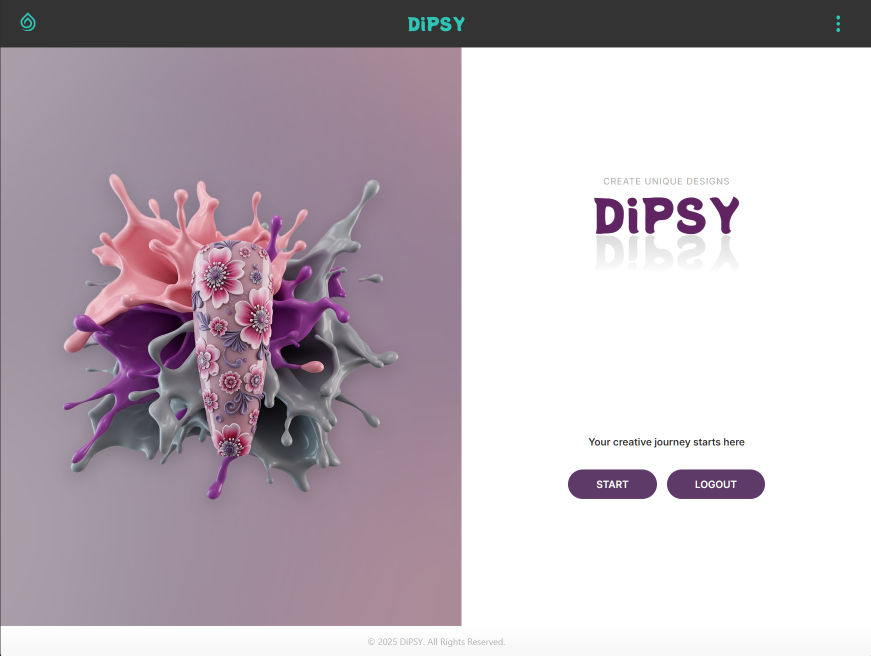

# 💅 Tipsy: The AI Nail Art Studio (Web App)

Welcome to the web version of the **Tipsy** design studio. This project is a modern, single-page React application that provides a desktop-friendly interface for generating AI nail art.

---

### ✨ Core Technologies

-   **Framework**: ⚛️ React (with Vite)
-   **Language**: 🔵 TypeScript
-   **Styling**: 🎨 Custom CSS-in-JS & CSS Modules
-   **Routing**: 🧭 React Router
-   **Authentication**: 🔥 Firebase Authentication
-   **Animations**: ✨ Framer Motion

---

### 🚀 Key Features

-   **Step-by-Step UI**: A guided, sequential interface that walks the user through the design process one step at a time.
-   **Interactive Animations**: Smooth page and element transitions powered by Framer Motion.
-   **Engaging Loading State**: Features the same floating star animations and fun facts as the mobile app to keep users engaged while waiting.
-   **Real-time Previews**: (If applicable) Shows selections as they are made.
-   **Responsive Design**: A clean layout that works on various screen sizes.

---

### 🛠️ Setup & Installation

1.  **Clone the repository:**
    ```bash
    git clone <repository-url>
    cd newnails-web-fe
    ```
2.  **Install dependencies:**
    ```bash
    npm install
    ```
3.  **Set up environment variables:**
    -   Create a `.env` file in the root directory.
    -   Add the following required variables:
        ```env
        # The public URL of your deployed backend API
        VITE_API_BASE_URL="http://localhost:3000"

        # Your Firebase project's public web API key
        VITE_FIREBASE_API_KEY="..."
        VITE_FIREBASE_AUTH_DOMAIN="..."
        VITE_FIREBASE_PROJECT_ID="..."
        VITE_FIREBASE_STORAGE_BUCKET="..."
        VITE_FIREBASE_MESSAGING_SENDER_ID="..."
        VITE_FIREBASE_APP_ID="..."
        ```
4.  **Run the development server:**
    ```bash
    npm run dev
    ```
    The application will be available at `http://localhost:5173` (or another port if 5173 is busy).

---

### 🖼️ Screenshots

<table>
  <tr>
    <td align="center"><b>Landing Page</b><br>
      
    </td>
    <td align="center"><b>Design Step</b><br>
      
    </td>
    <td align="center"><b>Design Step</b><br>
      
    </td>
  </tr>
  <tr>
    <td align="center"><b>Loading Step</b><br>
      
    </td>
    <td align="center"><b>Generated Art</b><br>
      
    </td>
    <td align="center"><b>Saved Favorites</b><br>
      
    </td>
  </tr>

</table>

